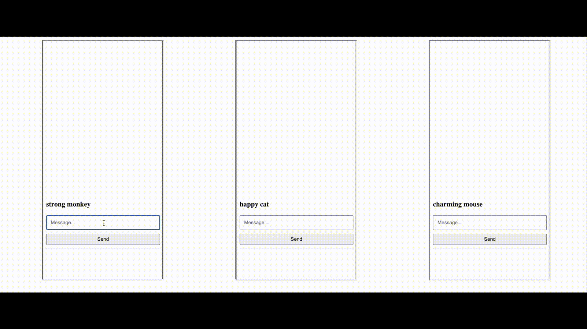

# Node/Websocket Messenger Application with Llama2 Suggested Replies

**What it is:** This is a multi-client messenger application where users receive realtime message updates and context-aware suggested replies powered by the Llama2 model.

**The stack:** The frontend is pure HTML/CSS/JavaScript and the backend is a Node.js/Express server leveraging websockets for realtime updates and client management. Suggested replies are provided server side and fulfilled by Ollama running the Llama2 model.

**Repository:** github.com/chaotic_biscuit/llama2-messenger-app

**Installation instructions:**

Install the package.json dependencies (_ws, express, @langchain/community_)

    npm install

On the same environment where the server will be run, install [Ollama](https://ollama.com/)

We'll need to pull a model

    ollama pull llama2
    ollama pull <model> // Any model works, just make sure server.js is updated

And finally run Ollama as a background service

    ollama run llama2

On success, you'll see "Ollama is running" at http://localhost:11434/

And finally run the server with

    npm start

On success, you will see "Server is listening on port: 8888"

**To chat:**

To use the application, open index.html in individual browser windows or use the multiclientview.html to spawn 3 clients side-by-side.
